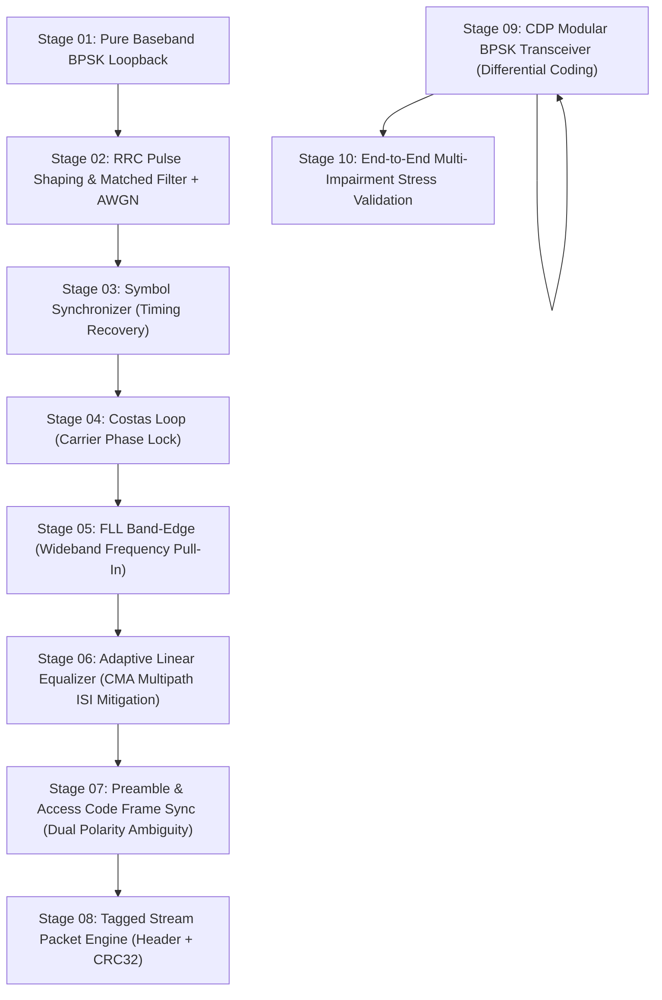

# PHY2 - Modular BPSK Physical Layer & Automated Optimization Suite

## Overview
**PHY2** is a modular, high-reliability Physical Layer suite built incrementally from the ground up for the CDP Software-Defined Radio (SDR) and software simulation environment. It replaces complex, error-prone configurations with a verified 10-stage architecture, dedicated SDR hardware flowgraphs (Pluto SDR, bladeRF, RTL-SDR), and an automated parameter optimization engine.

---

## Hardware Transceiver Suite (`PHY2/hardware/`)

Dedicated flowgraphs for physical SDR devices with QT GUI controls, live constellation displays, and PDU message debugging:

| Flowgraph | Hardware Device | Front-End Blocks |
|:---|:---|:---|
| [`cdp_transceiver_pluto.grc`](file:///home/mushabmna/Documents/CDP_Project/twowaycomdevice/PHY2/hardware/cdp_transceiver_pluto.grc) | **Adalm-Pluto SDR** | `iio_pluto_sink` & `iio_pluto_source` |
| [`cdp_transceiver_bladerf.grc`](file:///home/mushabmna/Documents/CDP_Project/twowaycomdevice/PHY2/hardware/cdp_transceiver_bladerf.grc) | **Nuand bladeRF** | `soapy_bladerf_sink` & `soapy_bladerf_source` |
| [`cdp_receiver_rtlsdr.grc`](file:///home/mushabmna/Documents/CDP_Project/twowaycomdevice/PHY2/hardware/cdp_receiver_rtlsdr.grc) | **RTL-SDR** | `soapy_rtlsdr_source` |
| [`cdp_transceiver_multi_hardware.grc`](file:///home/mushabmna/Documents/CDP_Project/twowaycomdevice/PHY2/hardware/cdp_transceiver_multi_hardware.grc) | **Universal Multi-Hardware** | Toggleable Pluto / BladeRF / RTL-SDR / Channel Model |

---

## Architecture Progression (Stages 01 - 10)



---

## Directory Structure

```
PHY2/
├── hardware/                          # Production SDR Hardware Flowgraphs
│   ├── cdp_transceiver_pluto.grc      # Adalm-Pluto SDR Transceiver
│   ├── cdp_transceiver_pluto.py
│   ├── cdp_transceiver_bladerf.grc    # Nuand bladeRF Transceiver
│   ├── cdp_transceiver_bladerf.py
│   ├── cdp_receiver_rtlsdr.grc        # RTL-SDR Receiver
│   ├── cdp_receiver_rtlsdr.py
│   ├── cdp_transceiver_multi_hardware.grc # Universal Multi-Hardware Front-End
│   ├── cdp_transceiver_multi_hardware.py
│   └── README.md
├── test_01_bpsk_loopback/             # Stage 01: Baseband BPSK Modulation & Slicing
├── test_02_bpsk_rrc_awgn/             # Stage 02: RRC Pulse Shaping (sps=4, alpha=0.35) & AWGN
├── test_03_bpsk_symbol_sync/          # Stage 03: Timing Recovery (Mueller & Müller TED)
├── test_04_bpsk_costas_loop/          # Stage 04: 2nd-Order Costas Loop Carrier Phase Recovery
├── test_05_bpsk_fll_band_edge/        # Stage 05: FLL Band-Edge Frequency Recovery (+/- 3.5% samp_rate)
├── test_06_bpsk_linear_equalizer/     # Stage 06: Adaptive Linear Equalizer (CMA 11-Tap FIR)
├── test_07_bpsk_preamble_access_code/ # Stage 07: Preamble + 64-bit Access Code Sync (Hardware + Sim)
│   ├── bpsk_preamble_access_code.grc
│   ├── bpsk_preamble_access_code_hardware.grc
│   └── run_test.py
├── test_08_bpsk_packet_crc32/         # Stage 08: Tagged Stream Packet Engine with CRC32 (Hardware + Sim)
│   ├── bpsk_packet_crc32.grc
│   ├── bpsk_packet_crc32_hardware.grc
│   └── run_test.py
├── test_09_bpsk_cdp_transceiver/      # Stage 09: CDP Modular Transceiver Architecture (Hardware + Sim)
│   ├── cdp_transceiver_bpsk.grc
│   ├── cdp_transceiver_bpsk_hardware.grc
│   └── run_test.py
├── test_10_bpsk_end_to_end_stress/    # Stage 10: Multi-Impairment High-Volume Stress Test
├── optimization/                      # Automated Non-GRC Parameter Optimization Suite
│   ├── ber_calculator.py              # BER & Packet Metrics Engine
│   ├── param_sweep.py                 # Multi-Parameter Grid Sweeper
│   ├── plot_results.py                # Standalone SVG Plotter & HTML Dashboard Generator
│   ├── run_auto_optimization.py       # Master Optimizer Runner
│   └── results/                       # Empirical Outputs & Plots
│       ├── optimal_parameters.json
│       ├── chart_01_ber_waterfall.svg
│       ├── chart_02_fll_bandwidth.svg
│       ├── chart_03_costas_bandwidth.svg
│       ├── chart_04_preamble_length.svg
│       └── dashboard.html
├── run_all_tests.py                   # Master Test Runner (Executes all 10 stages)
└── README.md
```

---

## Quick Start

### 1. Run with Physical SDR Hardware
Open in GNU Radio Companion and run:
- **Pluto SDR**: `gnuradio-companion "PHY2/hardware/cdp_transceiver_pluto.grc"`
- **bladeRF**: `gnuradio-companion "PHY2/hardware/cdp_transceiver_bladerf.grc"`
- **RTL-SDR**: `gnuradio-companion "PHY2/hardware/cdp_receiver_rtlsdr.grc"`
- **Universal Multi-Hardware**: `gnuradio-companion "PHY2/hardware/cdp_transceiver_multi_hardware.grc"`

### 2. Run Master Test Suite (All 10 Stages)
```bash
python3 PHY2/run_all_tests.py
```

### 3. Run Automated Parameter Optimization & BER Sweeper
```bash
python3 PHY2/optimization/run_auto_optimization.py
```
Open [`PHY2/optimization/results/dashboard.html`](file:///home/mushabmna/Documents/CDP_Project/twowaycomdevice/PHY2/optimization/results/dashboard.html) in your browser.
